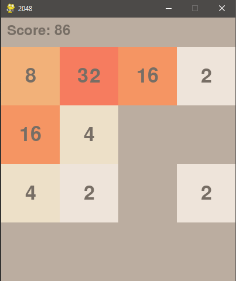

# 2048 Game

A classic 2048 game implemented using Pygame, featuring smooth animations for tile movements. This game is a fun and addictive sliding tile puzzle game that you can play directly on your computer.

## Features

- Smooth tile movement animations
- Simple and intuitive controls
- Real-time score updates
- Game over detection
- Visually appealing design

## Installation

1. **Clone the repository**:
    ```bash
    git clone https://github.com/nekros0day/2048-game.git
    ```
2. **Navigate to the project directory**:
    ```bash
    cd 2048-game
    ```
3. **Install the required dependencies**:
    ```bash
    pip install pygame
    ```

## How to Play

- **Run the game**:
    ```bash
    python 2048.py
    ```

- **Controls**:
    - `W` - Move tiles up
    - `S` - Move tiles down
    - `A` - Move tiles left
    - `D` - Move tiles right

- **Objective**:
    - Combine tiles with the same number to create a tile with the number 2048.
    - When there are no more possible moves, the game is over.

## Screenshots



## Code Overview

- **`2048.py`**: The main game file containing all the logic and rendering code.
- **`Tile` class**: Represents each tile in the game with its value and position.
- **Game logic**:
  - `initialize_game()`: Sets up the initial game state with two tiles.
  - `add_new_tile(board)`: Adds a new tile to the board at a random empty position.
  - `move(board, direction)`: Moves and merges tiles based on the input direction.
  - `calculate_score(board)`: Calculates the current score by summing the values of all tiles.

## Contributing

Contributions are welcome! If you find any bugs or have suggestions for improvements, feel free to open an issue or create a pull request.

1. **Fork the repository**
2. **Create a new branch**:
    ```bash
    git checkout -b feature-name
    ```
3. **Commit your changes**:
    ```bash
    git commit -m "Add some feature"
    ```
4. **Push to the branch**:
    ```bash
    git push origin feature-name
    ```
5. **Open a pull request**

## Acknowledgments

- Inspired by the original 2048 game created by Gabriele Cirulli.

---

Happy playing! 🎮
